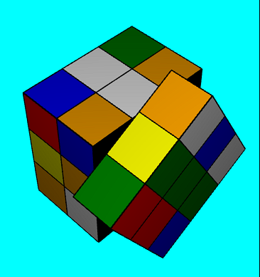
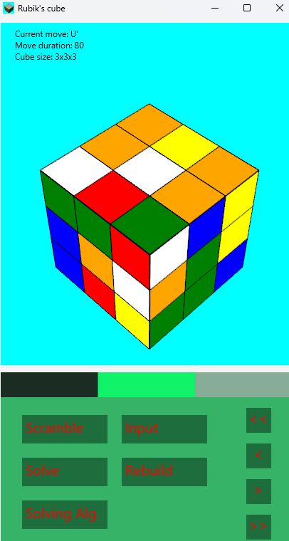
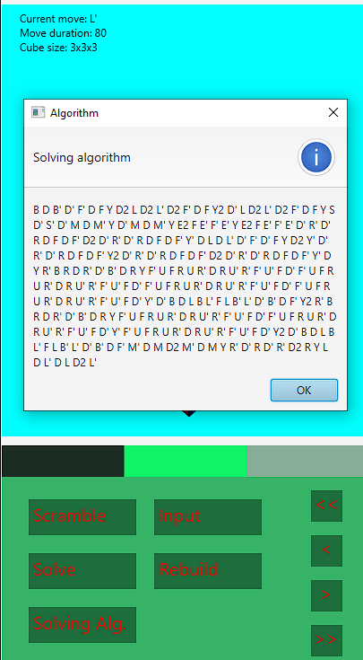
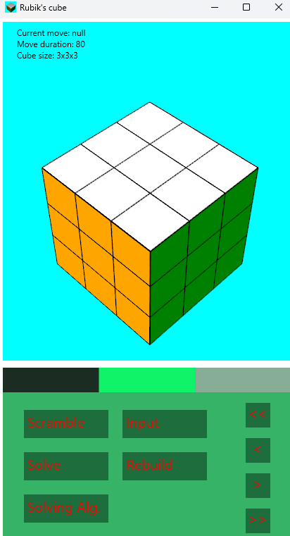
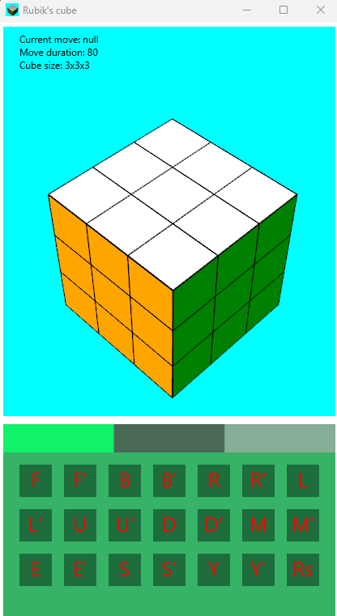
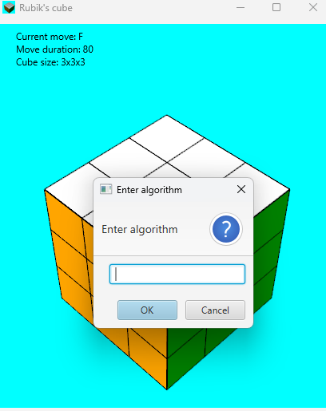

# RubikCube 3D

A 3D Rubik's Cube simulator and solver built with JavaFX. Watch the cube come to life and solve itself with custom algorithms or pre-defined moves.

## Features
- Custom moves for any cube configuration
- Ability to run your own algorithms
- **Solving algorithm using the Layer-by-Layer (LBL) method** *(3x3 cubes only)*
- Supports cubes of any size (NxNxN)

## Requirements
- **Java JDK 17+**

## How to Run
Open a terminal in the project folder and run:

```bash
./gradlew run


# Screenshots








